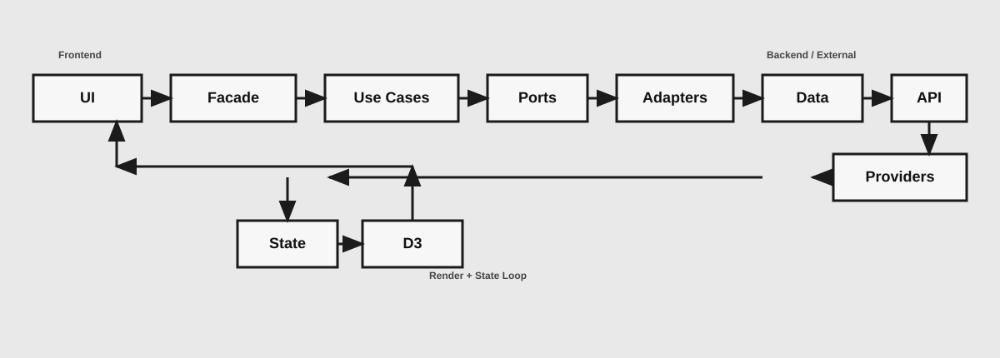

# Market Visualizer

Interactive market dashboard for comparing Bitcoin, Ethereum, Gold, SPY, QQQ, and Austin housing data with configurable time ranges.

## Live Demo
- Production: [https://market-visualization-6d9671c91b62.herokuapp.com](https://market-visualization-6d9671c91b62.herokuapp.com)

## Stack
- Angular 18 (standalone components + signals)
- D3.js (custom responsive SVG chart rendering)
- SCSS theme system (tokenized styles)
- Node.js + Express API layer (`/api/*`)
- Jest + `jest-preset-angular`

## Features
- Multi-asset selector (BTC, ETH, Gold, SPY, QQQ, Austin Housing)
- Time-range controls with asset-aware behavior
- CoinGecko-backed crypto pricing (including Gold via `tether-gold`)
- Stooq-backed ETF pricing for SPY and QQQ
- FRED-backed Austin housing median listing series
- Unified API routing for local and production environments

## Architecture
- UI layer (`src/app/components/*`)
  - `dashboard` handles shell/top-level controls.
  - `market-chart` owns chart-specific UI, interaction state, and D3 rendering integration.
- Application layer (`src/app/core/services/*`)
  - `market.service.ts` (exported as `MarketService`) is the central facade/state orchestrator.
  - `use-cases/*` contains domain operations like range policy, compare normalization, and load orchestration.
  - `market-state.store.ts` holds signal-based app state.
- Ports/adapters (`src/app/core/ports/*`, `src/app/core/services/adapters/*`)
  - Ports define data contracts (`CryptoSeriesPort`, `StockSeriesPort`, `HousingSeriesPort`).
  - Gateways adapt concrete data services to those ports.
- Data sources (`src/app/core/services/data/*`)
  - `crypto-market-data.service.ts` -> `/api/coingecko/*`
  - `stock-market-data.service.ts` -> `/api/stocks/*`
  - `austin-housing-data.service.ts` -> `/api/fred/*`
- Backend proxy/API (`server.js`)
  - Proxies upstream providers (CoinGecko, Stooq, FRED), applies normalization, and handles simple response caching.
  - Serves Angular build output for production routing.
- Styling system (`src/styles/themes/*`)
  - Token-first SCSS setup with modular theme files (`_tokens.scss`, `_chips.scss`, `_controls.scss`, `_toggle.scss`, etc.).
  - Components mostly compose shared theme classes with local layout rules.

### Data Flow (High-Level)
- Request path: `UI -> Facade -> Use Cases -> Ports -> Adapters -> Data -> API -> Providers`
- Response path: `Providers -> API -> Data -> Facade -> State`
- Render path: `State -> UI -> D3`

## Local Development
1. Clone: `git clone https://github.com/clarkmyfancy/market-visualizer.git`
2. Install deps: `npm install`
3. Set CoinGecko key (recommended):
   - `export COINGECKO_DEMO_API_KEY=your_key_here`
4. Start app + API server: `npm run dev`
5. Open: [http://localhost:4200](http://localhost:4200)

## Scripts
- `npm run dev` - start Angular dev server and Node API server
- `npm test` - run unit tests
- `npm run build` - build Angular app
- `npm run build:prod` - production build
